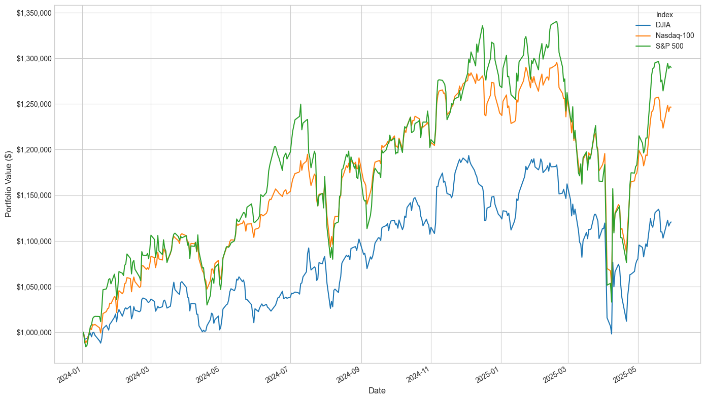

=================================================
Market Index and Conventional Trading Strategies
=================================================

We use market indexes and conventional trading strategies as baselines in the FinAI contests. They are widely adopted in the financial industry.

Market Indexes
------------------

Stock markets:

- **DJIA**: The Dow Jones Industrial Average index is a price-weighted index for 30 blue-chip U.S. companies. It is calculated as the sum of constituent stock prices divided by the Dow Divisor. The divisor is a constant adjusted for stock splits and structural changes. DJIA is one of the oldest and most recognized market indexes. It provides a real-world baseline to evaluate whether a FinRL agent outperforms a passive investment strategy.

- **S&P 500**: The Standard and Poor's 500 is a capitalization-weighted index tracking the stock performance of 500 leading companies. Covering approximately 80% of the total market capitalization, it offers a broader and more diversified baseline.

- **Nasdaq-100**: The Nasdaq-100 is a stock market index consists of 100 of the largest non-financial companies listed on the Nasdaq stock exchange. It is a capitalization-weighted index. The NASDAQ-100 is heavily concentrated in the technology sector but also includes firms from industries such as consumer discretionary, healthcare, communication services, and industrials. Different from the S&P 500, the NASDAQ-100 excludes financial companies such as banks and insurance firms. 

We can use the ``yfinance`` library to download the data for these indexes. Then we plot the performance of these market indexes starting from an initial investment of $1,000,000, from 01/01/2024 to 06/01/2025. 

.. code-block:: python

    import yfinance as yf
    import matplotlib.pyplot as plt

    # Download DJIA, Nasdaq-100, and S&P 500 data
    tickers = ['^DJI', '^NDX', '^GSPC']
    start_date = '2024-01-01'
    end_date = '2025-06-01'
    market_index_data = yf.download(tickers, start=start_date, end=end_date, auto_adjust=False)

    # Get the portfolio value with initial investment of $1,000,000
    close_prices = data['Adj Close']
    initial_investment = 1000000
    normalized_close_prices = close_prices / close_prices.iloc[0]
    portfolio_value = normalized_close_prices * initial_investment
    portfolio_value.columns = ['DJIA', 'Nasdaq-100', 'S&P 500']

Cryptocurrency markets:

- **CoinDesk Market Index (CMI)**: `The CoinDesk Market Index <https://indices.coindesk.com/indices/cmi>`_ tracks the broad digital asset market using a market-cap-weighted approach. It includes a diverse set of cryptocurrencies, which are included in Digital Asset Classification Standard (DACS) and not assigned to the Stablecoin Sector. The most important cryptocurrencies in the CMI include Bitcoin (BTC), Ethereum (ETH), and XRP. The CMI is designed to be a benchmark for the performance of the cryptocurrency market as a whole.

- **Nasdaq Crypto Index (NCI)**: `The Nasdaq Crypto Index (NCI) <https://www.nasdaq.com/solutions/global-indexes/thematic/crypto>`_ is a market-capitalization-weighted index designed to track the performance of a diversified basket of major USD-traded cryptocurrencies. The Index is designed to be dynamic in nature, broadly representative of the market, and readily trackable by investors. 

Conventional Trading Strategies
---------------------------------

- **Mean-Variance Optimization**: Mean-variance optimization, as part of Modern Portfolio Theory (MPT) [Markowitz1952]_, constructs portfolios that maximize the expected return for a given level of risk. It uses expected asset returns and covariances to solve an optimization problem. We typically use the past one year's daily price data to calculate expected returns and the covariance matrix. We limit individual stock weights to a maximum of 5%. Mean-variance optimization is a foundational technique in portfolio management and can serve as a classical financial optimization strategy baseline.
- **Minimum-Variance Optimization**: Minimum variance optimization is an investment strategy focused on constructing portfolios that minimize overall portfolio risk (variance) while potentially accepting lower returns. It prioritizes diversification and the selection of assets with low correlation to each other, aiming to reduce the portfolio's sensitivity to market fluctuations. This strategy is particularly useful in volatile markets or for risk-averse investors. It can be implemented using historical price data to estimate the covariance matrix and optimize asset weights accordingly.
- **Equally Weighted Portfolio**: An equally weighted portfolio is a simple investment strategy where the investor allocates an equal percentage of their total capital to each asset in the portfolio. This approach is straightforward and does not require complex calculations or forecasts. It is often used as a benchmark for evaluating the performance of more sophisticated strategies.
- **Buy and Hold**: The buy-and-hold strategy is a passive investment approach where an investor purchases assets and holds them for a long period, regardless of market fluctuations. This strategy is based on the assumption that, over the long term, markets tend to rise, and short-term volatility will not significantly impact the overall performance. It is often used as a benchmark to compare the performance of active trading strategies.

.. [Markowitz1952] Harry Markowitz. "Portfolio Selection," *Journal of Finance*, 1952.
