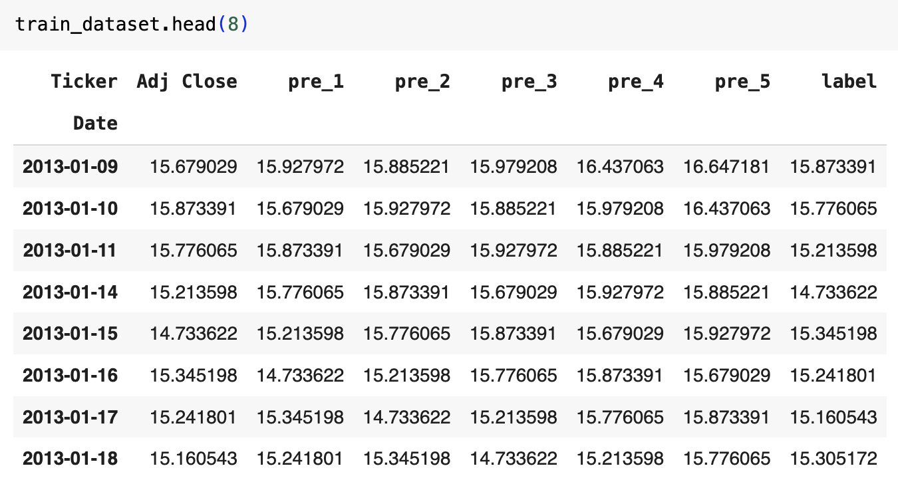
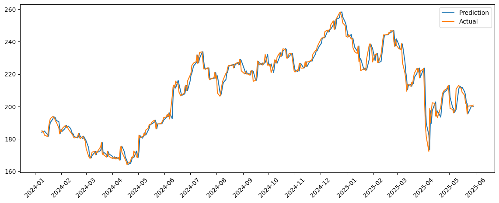

==================
ML Methods
==================

We also consider the following conventional machine learning methods as baselines.

Linear Regression Model
----------------------------
The linear regression model is a simple yet effective method for predicting stock prices based on historical data. It assumes a linear relationship between the input features (e.g., past stock prices) and the target variable (future stock price). The model can be trained using historical data to learn the coefficients that minimize the prediction error.

Here we provide an example of how to train a linear regression model for stock price prediction:
    - Stock: AAPL
    - Training period: 01/01/2013 to 12/31/2023
    - Testing period: 01/01/2024 to 06/01/2026
    - Features: the adjusted close price at t-5, t-4, t-3, t-2, t-1 and t.
    - Target: the price at t+1.

Dataset Preparation
~~~~~~~~~~~~~~~~~~~~~
We can use the `yfinance` library to download the historical stock data for AAPL. We then create a dataset with the specified features and target variable.

.. code-block:: python

    # import necessary libraries
    import yfinance as yf
    import pandas as pd
    import numpy as np
    import matplotlib.pyplot as plt
    import matplotlib.dates as mdates
    from sklearn.linear_model import LinearRegression

    # Set the ticker symbol and the training and testing periods
    ticker = ["AAPL"]
    train_start_date = "2013-01-01"
    train_end_date = "2023-12-31"
    test_start_date = "2024-01-01"
    test_end_date = "2025-06-01"

    # Download the training data and testing data.
    train_data = yf.download(ticker, start=train_start_date, end=train_end_date, auto_adjust=False)['Adj Close']
    train_data = train_data.dropna()
    train_data = train_data.rename(columns={'AAPL': 'Adj Close'})

    test_data = yf.download(ticker, start=test_start_date, end=test_end_date, auto_adjust=False)['Adj Close']
    test_data = test_data.dropna()
    test_data = test_data.rename(columns={'AAPL': 'Adj Close'})

When downloading the data, we

    - **Drop the open, high, low, close, and volume columns**, keeping only the adjusted close price. This is because these features tend to have high correlation with the adjusted close price, and we want to avoid multicollinearity in our model. However, they can be used for feature engineering if needed, i.e, constructing technical indicators.
    - **Use adjusted close price instead of close price** to account for stock splits and dividends, which can affect the stock price over time.

.. code-block:: python

    def add_features(stock_data):
        """
        Adds lagged features and a label column to the stock data DataFrame.

        Args:
            stock_data (pd.DataFrame): DataFrame containing stock data with an 'Adj Close' column.

        Returns:
            pd.DataFrame: DataFrame with 'pre_1' through 'pre_5' (lagged 'Adj Close' prices from t-5 to t-1) and 'label' (next day (t+1) 'Adj Close' price) columns added.
        """
        stock_data['pre_1'] = stock_data['Adj Close'].shift(1)
        stock_data['pre_2'] = stock_data['Adj Close'].shift(2)
        stock_data['pre_3'] = stock_data['Adj Close'].shift(3)
        stock_data['pre_4'] = stock_data['Adj Close'].shift(4)
        stock_data['pre_5'] = stock_data['Adj Close'].shift(5)
        num_days_prediction = 1
        stock_data['label'] = stock_data['Adj Close'].shift(-num_days_prediction)
        stock_data.dropna(inplace=True)
        return stock_data
    
    train_dataset = add_features(train_data)
    test_dataset = add_features(test_data)

We add the past prices as features, which are the adjusted close prices at t-1, t-2, t-3, t-4, and t-5. The target variable is the adjusted close price at t+1. We drop any rows with missing values after adding the features. The dataset looks like this:

Taking the data at 2023-01-17 as an example:

    - t = "2023-01-17", the close price is 15.241801 (as put in column Adj Close)
    - t-5 = "2023-01-10", the close price is 15.873391 (as put in column pre_5)
    - t-4 = "2023-01-11", the close price is 15.776065 (as put in column pre_4)
    - t-3 = "2023-01-14", the close price is 15.213598 (as put in column pre_3)
    - t-2 = "2023-01-15", the close price is 14.733622 (as put in column pre_2)
    - t-1 = "2023-01-16", the close price is 15.345198 (as put in column pre_1)
    - t+1 = "2023-01-18", the close price is 15.160543 (as put in column label)

There is no future information leakage in this dataset, as the features are all based on past prices and the target variable is the price at t+1. After processing the data, we have the 2762 training days and 348 testing days.

Train the Linear Regression Model
~~~~~~~~~~~~~~~~~~~~~~~~~~~~~~~~~~~
We can now train the linear regression model using the training dataset. 

.. code-block:: python

    # Set the X and y variables for training
    X_train = train_dataset.drop(columns=['label'])
    X_train = X_train.values # Converts to a NumPy Array

    y_train = train_dataset['label']
    y_train = y_train.values # Converts to a NumPy Array

    # Create and fit the linear regression model
    model = LinearRegression()
    model.fit(X_train, y_train)
    
    # Print the model coefficients
    print("Model coefficients:", model.coef_)
    print("Model intercept:", model.intercept_)

The model coefficients represent the weights assigned to each feature:
.. table:: Model Coefficients

   +-------------+-----------+-----------+-----------+-----------+------------+------------+
   | Adj Close   | pre_1     | pre_2     | pre_3     | pre_4     | pre_5      | Intercept  |
   +=============+===========+===========+===========+===========+============+============+
   | 0.9613306   | 0.0130344 | 0.0113469 | 0.0094702 | 0.0419768 | -0.0368521 | 0.0450987  |
   +-------------+-----------+-----------+-----------+-----------+------------+------------+

We can observe that the model assigns the hightest weight to the close price at time 5. It assigns higher weights to the more recent past prices (t-1, t-2) and lower weights to the older prices (t-4, t-5). This indicates that the model is more sensitive to recent price movements, which is a common characteristic of stock price prediction models.

Test the Model and Plot the Results
~~~~~~~~~~~~~~~~~~~~~~~~~~~~~~~~~~~~~~~
We can now use the trained model to make predictions on the testing dataset and plot the results.

.. code-block:: python

    # Set the X and y variables for testing
    X_test = test_dataset.drop(columns=['label'])
    X_test = X_test.values
    y_test = test_dataset['label']
    y_test = y_test.values

    # Make predictions
    prediction = model.predict(X_test)

    # Plot the predictions
    date = pd.to_datetime(test_data.index)
    plt.figure(figsize=(14, 5))
    plt.plot(date, prediction, label='Prediction')
    plt.plot(date, y_test, label='Actual')
    plt.gca().xaxis.set_major_formatter(mdates.DateFormatter('%Y-%m'))
    plt.gca().xaxis.set_major_locator(mdates.MonthLocator(interval=1))
    plt.xticks(rotation=45)
    plt.legend()
    plt.show()

To employs the linear regression model for stock trading, we can a linear regression model for each stock in the portfolio. The model can be trained on historical data and more technical indicators to predict the future price of each stock. Based on the predictions, a trading decision can be made. For example, a trading signal is generated based on the predicted price change:
    
    - **Buy Signal**: If the predicted price is more than 0.5% higher than the current closing price.
    - **Sell Signal**: If the predicted price is more than 0.5% lower than the current closing price.
    - **Hold Signal**: If the predicted price change is within the -0.5% to 0.5% range.