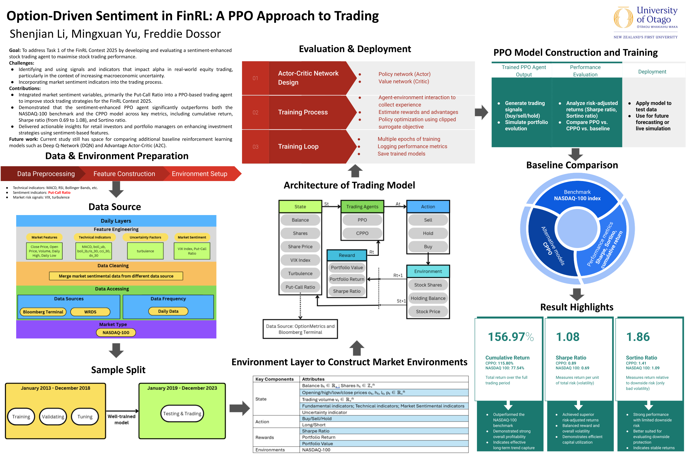
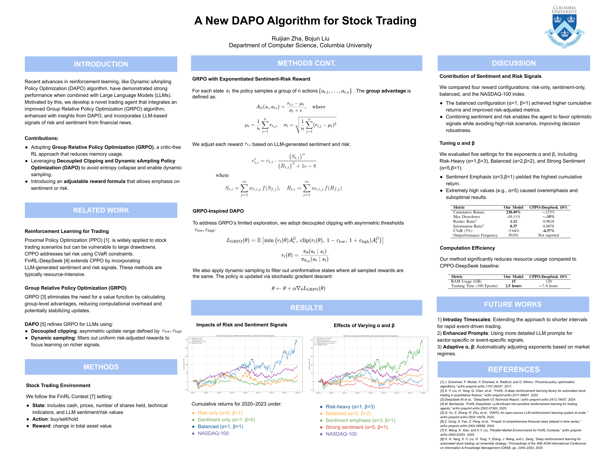
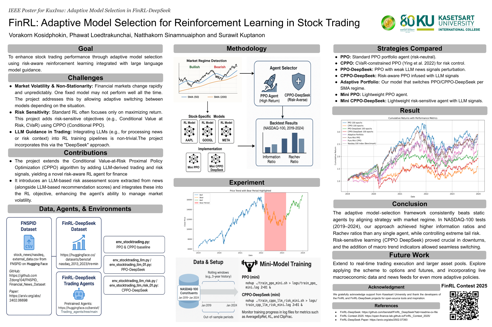
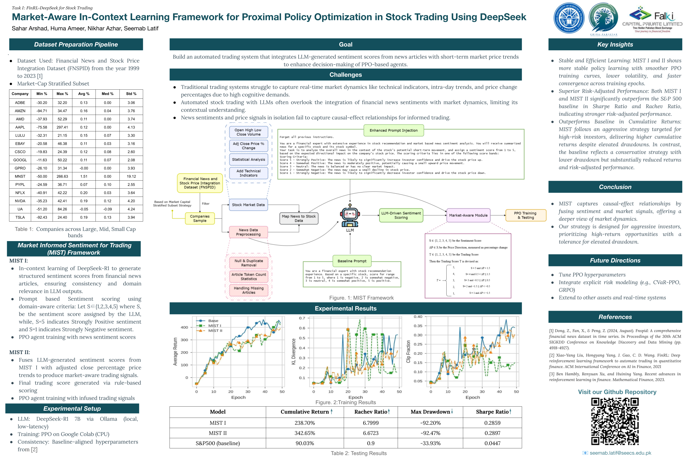
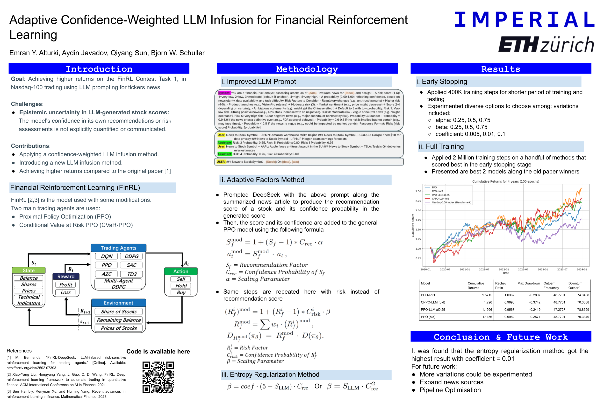
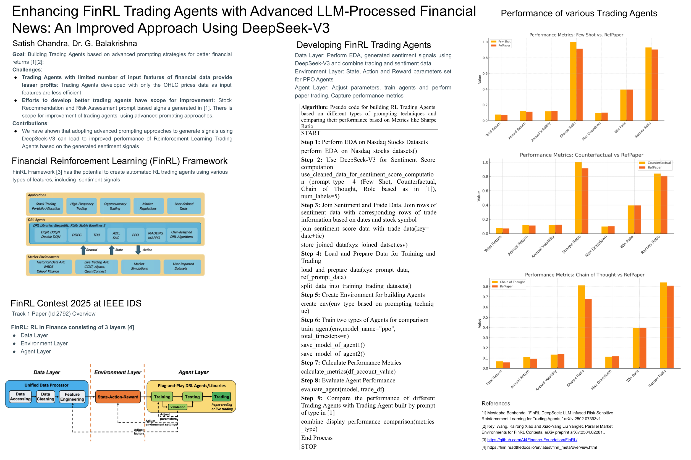
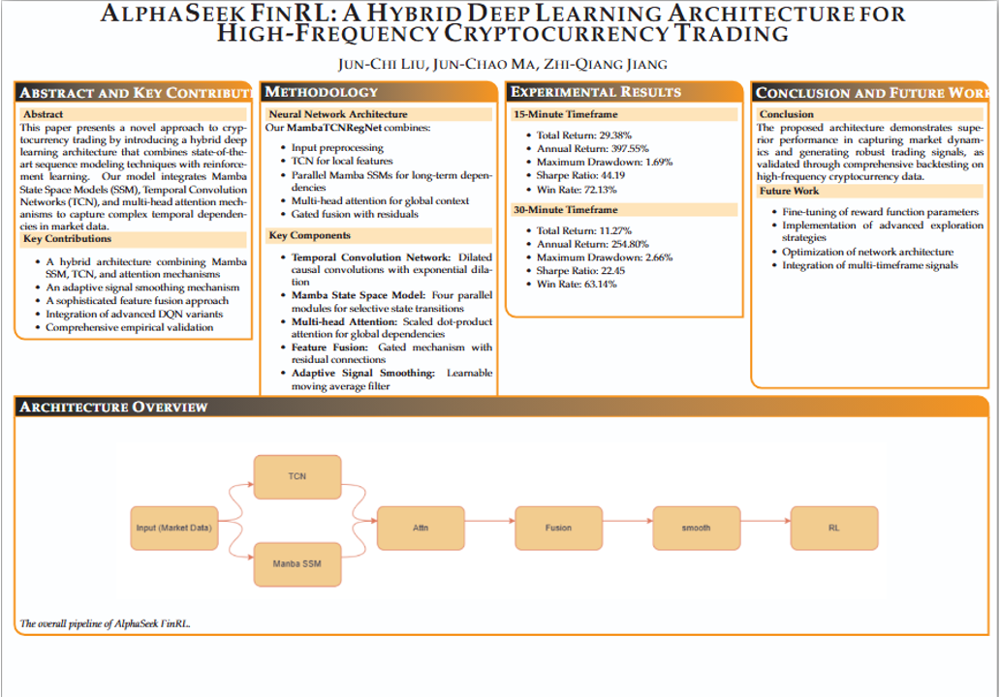
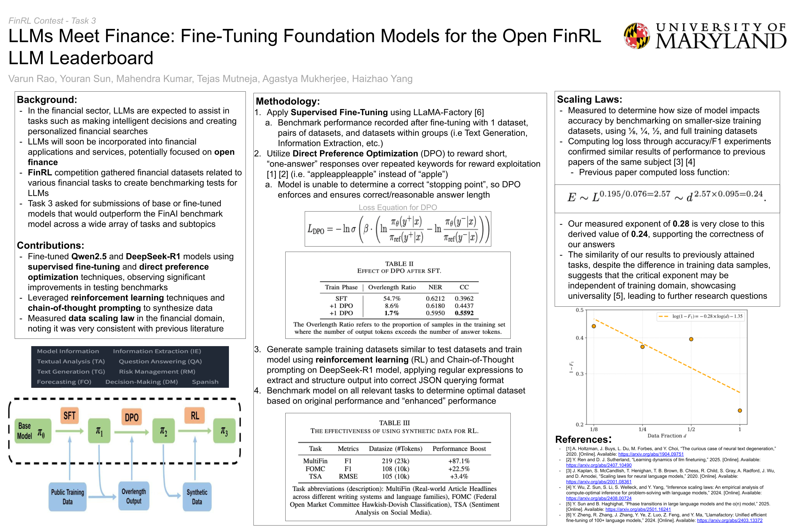
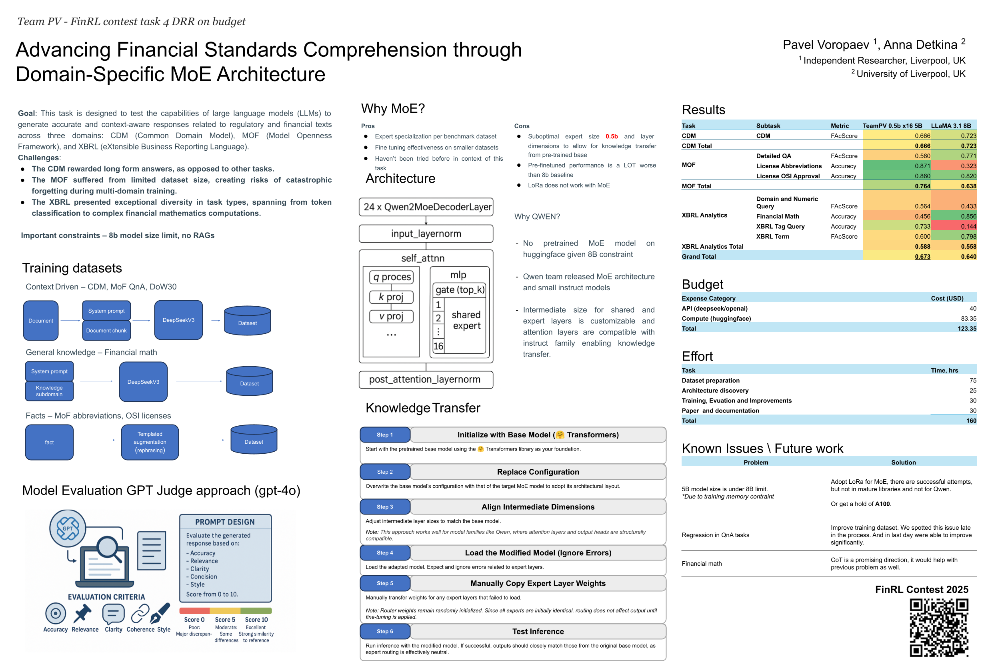

===============================================================
Accepted Papers
===============================================================

`Parallel Market Environments for FinRL Contests <https://www.cloud-conf.net/datasec/2025/proceedings/pdfs/IDS2025-3SVVEmiJ6JbFRviTl4Otnv/966100a064/966100a064.pdf>`_
    *Keyi Wang (Columbia University, USA), Kairong Xiao (Columbia University, USA), Xiao-Yang Liu Yanglet (Columbia University, USA)*

`HMM-Based Market Regime Detection with RL for Portfolio Management <https://www.cloud-conf.net/datasec/2025/proceedings/pdfs/IDS2025-3SVVEmiJ6JbFRviTl4Otnv/966100a067/966100a067.pdf>`_
    *Jean Ndoutoumou (Numeraxial LLC, NY), Zining Yin (Columbia University, NY), Xiaochang Cheng (New York University, NY)*

Task 1 FinRL-DeepSeek for Stock Trading
---------------------------------------------------------------

`Option-Driven Sentiment in FinRL: A PPO Approach to Trading <https://www.cloud-conf.net/datasec/2025/proceedings/pdfs/IDS2025-3SVVEmiJ6JbFRviTl4Otnv/966100a061/966100a061.pdf>`_
    *Shenjian Li (University of Otago, New Zealand), Mingxuan Yu (University of Otago, New Zealand), Freddie Dossor (University of Otago, New Zealand)*

.. raw:: html

     

`A New DAPO Algorithm for Stock Trading <https://www.cloud-conf.net/datasec/2025/proceedings/pdfs/IDS2025-3SVVEmiJ6JbFRviTl4Otnv/966100a046/966100a046.pdf>`_

    *Ruijian Zha (Columbia University, USA), Bojun Liu (Columbia University, USA)*

.. raw:: html

     

`FinRL: Adaptive Model Selection for Reinforcement Learning in Stock Trading <https://www.cloud-conf.net/datasec/2025/proceedings/pdfs/IDS2025-3SVVEmiJ6JbFRviTl4Otnv/966100a070/966100a070.pdf>`__

    *Vorakorn Kosidphokin (Kasetsart University, Thailand), Phawat Loedtrakunchai (Kasetsart University, Thailand), Natthakorn Sinamnuaiphon (Kasetsart University, Thailand), Surawit Kuptanon (Kasetsart University, Thailand)*

.. raw:: html

     

`FinRL Contest 2025 Task 1: Market-Aware In-Context Learning Framework for Proximal Policy Optimization in Stock Trading using DeepSeek <https://www.cloud-conf.net/datasec/2025/proceedings/pdfs/IDS2025-3SVVEmiJ6JbFRviTl4Otnv/966100a075/966100a075.pdf>`_
    *Sahar Arshad (National University of Sciences and Technology (NUST), Pakistan), Huma Ameer (National University of Sciences and Technology (NUST), Pakistan), Nikhar Azhar (National University of Sciences and Technology (NUST), Pakistan), Seemab Latif (National University of Sciences and Technology (NUST), Pakistan)*

.. raw:: html

     

`Adaptive Confidence-Weighted LLM Infusion for Financial Reinforcement Learning <https://www.cloud-conf.net/datasec/2025/proceedings/pdfs/IDS2025-3SVVEmiJ6JbFRviTl4Otnv/966100a078/966100a078.pdf>`_
    *Emran Y. Alturki (Imperial College London), Aydin Javadov (ETH Zürich), Qiyang Sun (Imperial College London), Björn W. Schuller (Imperial College London; Technical University of Munich)*

.. raw:: html

     

`Enhancing FinRL Trading Agents with Advanced LLM-Processed Financial News: An Improved Approach using DeepSeek-V3 <https://www.cloud-conf.net/datasec/2025/proceedings/pdfs/IDS2025-3SVVEmiJ6JbFRviTl4Otnv/966100a052/966100a052.pdf>`_
    *Satish Chandra (Anurag University, India), G. Balakrishna (Anurag University, India)*

.. raw:: html

     

Task 2 FinRL-AlphaSeek for Crypto Trading
---------------------------------------------------------------
`AlphaSeek FinRL: A Hybrid Deep Learning Architecture for High-Frequency Cryptocurrency Trading <https://www.cloud-conf.net/datasec/2025/proceedings/pdfs/IDS2025-3SVVEmiJ6JbFRviTl4Otnv/966100a054/966100a054.pdf>`_
    *Jun-Chi Liu (East China University of Science and Technology, China), Jun-Chao Ma (East China University of Science and Technology, China), Zhi-Qiang Jiang (East China University of Science and Technology, China)*

.. raw:: html

     

Task 3 Open FinLLM Leaderboard -- Models with Reinforcement Fine-Tuning (ReFT)
-------------------------------------------------------------------------------
`LLMs Meet Finance: Fine-Tuning Foundation Models for the Open FinLLM Leaderboard <https://www.cloud-conf.net/datasec/2025/proceedings/pdfs/IDS2025-3SVVEmiJ6JbFRviTl4Otnv/966100a057/966100a057.pdf>`_
    *Varun Rao (University of Maryland, MD), Youran Sun (University of Maryland, MD), Mahendra Kumar (University of Maryland, MD), Tejas Mutneja (University of Maryland, MD), Agastya Mukherjee (University of Maryland, MD), Haizhao Yang (University of Maryland, MD)*

.. raw:: html

     

Task 4 Open FinLLM Leaderboard -- Digital Regulatory Reporting
---------------------------------------------------------------
`RKEFino1: A Regulation Knowledge-Enhanced Large Language Model <https://www.cloud-conf.net/datasec/2025/proceedings/pdfs/IDS2025-3SVVEmiJ6JbFRviTl4Otnv/966100a049/966100a049.pdf>`_
    *Yan Wang (Yale University, USA), Yueru He (Columbia University, USA), Ruoyu Xiang (New York University, USA), Jeff Zhao (The University of Texas at Austin, USA)*

.. raw:: html

     

`Advancing Financial Standards Comprehension through Domain-Specific MoE Architecture <https://www.cloud-conf.net/datasec/2025/proceedings/pdfs/IDS2025-3SVVEmiJ6JbFRviTl4Otnv/966100a072/966100a072.pdf>`_
    *Pavel Voropaev (Independent ), Anna Detkina (University of Liverpool)*

