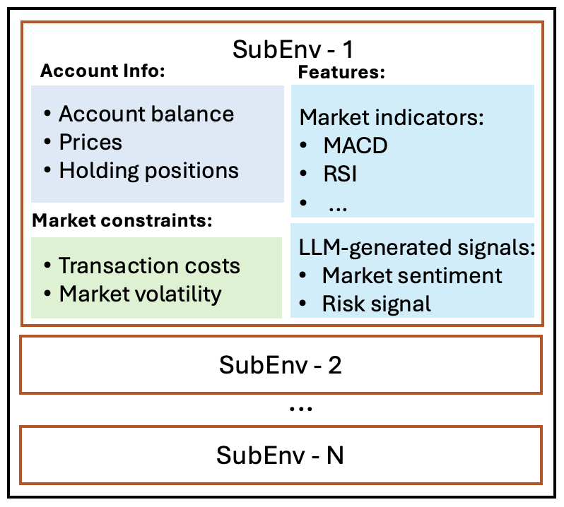

=============================
Environment
=============================

High-quality market environments are crucial to develop powerful trading agents. Financial data, featuring non-stationary and low signal-to-noise ratio, is processed into standard gym-style  market environments. A financial task is modeled as a Markov Decision Process (MDP) by defining the state, action, and reward. In this section, we summarize the parallel market environments used in the FinAI and FinRL Contests, including the MDP, environment functions, market constraints, and massively parallel simulations on GPUs.

Markov Decision Process
--------------------------------
We formulate stock and cryptocurrency trading tasks as Markov Decision Processes (MDPs) [9]_.

- **State** :math:`\mathbf{s}_t = [b_t, \mathbf{p}_t, \mathbf{h}_t, \mathbf{f}_t] \in \mathbb{R}^{K(I+2)+1}` represents market conditions at time :math:`t`. :math:`b_t \in \mathbb{R}` is the account balance. :math:`\mathbf{p}_t \in \mathbb{R}^{K}` is the prices of stocks or cryptocurrencies, where :math:`K` is the number of assets. :math:`\mathbf{h}_t \in \mathbb{R}^{K}` is the holding positions. :math:`\mathbf{f}_t \in \mathbb{R}^{KI}` is the feature vector, where there are :math:`I` features for each asset.

- **Action** :math:`\mathbf{a}_t \in \mathbb{R}^{K}` represents trading actions at time :math:`t`, such that :math:`\mathbf{h}_{t+1} = \max(\mathbf{h}_t + \mathbf{a}_t, 0)` (making :math:`\mathbf{h}_{t+1}` nonnegative). An entry :math:`a_t^i > 0, i = 1, \dots, K` indicates buying :math:`a_t^i` shares of assets :math:`i`, while :math:`a_t^i < 0` indicates selling and :math:`a_t^i = 0` indicates holding the current position. Each entry of :math:`\mathbf{h}_{t+1}` is nonnegative, which means the agent cannot sell more shares than it currently holds.

- **State-transition function** :math:`\delta(s_{t+1}|s_t, \mathbf{a}_t)` defines the probability distribution over the next state :math:`s_{t+1}` given the current state :math:`s_t` and action :math:`\mathbf{a}_t`. Transitions are governed by real-world asset price movements and trading outcomes. In simulation with historical market data, the transitions may be deterministic during training. In real-time trading, the state transition function is stochastic.

- **Reward** :math:`r_{t+1} = R(s_t, \mathbf{a}_t, s_{t+1})` is an incentive signal to encourage or discourage the trading agent to perform action :math:`\mathbf{a}_t` at state :math:`s_t`. We use :math:`r_{t+1}` instead of :math:`r_t` to reflect the delayed reward in financial markets. It emphasizes that the reward :math:`r_{t+1}` is determined at the next state :math:`s_{t+1}` after taking action :math:`\mathbf{a}_t`. The reward can be defined as the change in the total asset value, i.e., :math:`R(s_t, \mathbf{a}_t, s_{t+1}) = v_{t+1} - v_t`, where :math:`v_t = b_t + \mathbf{p}_t^\top \mathbf{h}_t` is the total asset value at time :math:`t`. The reward can also be penalized for high-risk signals.

- **Discount factor** :math:`\gamma \in (0,1)` is used to evaluate discounted expected return at time :math:`t`. The discount factor :math:`\gamma` determines the present value of future rewards.

Note that a policy :math:`\pi(\cdot \mid s_t)` is a probability distribution over actions at state :math:`s_t`. It determines the likelihood of each possible trading action given the current market conditions. The trading agent’s objective is to learn a policy :math:`\pi` that maximizes cumulative positive rewards while minimizing losses over time.

In the state :math:`s_t`, the holding positions :math:`\mathbf{h}_t` are typically constrained to be nonnegative in long-only trading settings, where the agent is not allowed to short assets. The feature vector :math:`\mathbf{f}_t` can include market indicators (e.g., moving average convergence divergence), factors learned by neural networks, and LLM-engineered signals from financial news or regulatory filings. The action :math:`\mathbf{a}_t` can be discrete or continuous, depending on the task. It may support long-only or long-short strategies. The reward function :math:`R` can use the Sharpe ratio in addition to the change in asset value. It can be further adjusted by risk or market sentiment to better reflect real-world trading scenarios.

For example, a trading task is to develop a trading agent for all 30 constituent stocks in the Dow Jones Index with an initial investment of $1 million. In this setting, the number of assets is :math:`K = 30`. The state includes the account balance with :math:`b_0 = 100,000`, prices of the 30 stocks, holding positions of the 30 stocks, and :math:`I = 4` technical indicators for each stock. The state space has a dimension :math:`K(I+2)+1 = 181`. The action space has dimension :math:`K = 30`. An entry, for example, :math:`a_t^1 = 5` means buying 5 shares of the first stock in the portfolio. The reward function is the change in the total asset value, with :math:`v_0 = 100,000`. Taking the first stock as an example, assume at time :math:`t`, the account balance is :math:`b_t = 100,000`, the price of the first stock is :math:`p_t^1 = 200`, and the shares of the first stock are :math:`h_t^1 = 10`. The agent buys 5 shares of the first stock (:math:`a_t^1 = 5`) and the price increases to :math:`p_{t+1}^1 = 201` at time :math:`t + 1`. Assuming holding all other 29 stocks, the state is updated where :math:`b_{t+1} = 99,000`, :math:`p_{t+1}^1 = 201`, and :math:`h_{t+1}^1 = 15`. The return :math:`r_t = v_{t+1} - v_t = (b_{t+1} + \mathbf{p}_{t+1}^\top \mathbf{h}_{t+1}) - (b_t + \mathbf{p}_t^\top \mathbf{h}_t) = -1000 + 201 \cdot 15 - 200 \cdot 10 = 15`. In this example, the agent only operates on the first stock.

Step, Reward, Reset Functions
--------------------------------
The operations in the FinRL market environment include:

- **reset**: :math:`\mathbf{s}_t \rightarrow \mathbf{s}_0`, resets the environment to its initial state.
- **step**: :math:`(\mathbf{s}_t, \mathbf{a}_t) \rightarrow \mathbf{s}_{t+1}`, executes :math:`\mathbf{a}_t` and updates :math:`\mathbf{s}_t` to :math:`\mathbf{s}_{t+1}`.
- **reward**: :math:`(\mathbf{s}_t, \mathbf{a}_t, \mathbf{s}_{t+1}) \rightarrow r_{t+1}`, computes the reward.

Market Constraints
--------------------------------
To reflect the real-world trading scenario, we incorporate near-real trading constraints:

- **Transaction costs.** We set a cost of 0.1% for each action \{buy, sell\}, accounting for commission and slippage.
- **Market volatility.** The turbulence index and VIX index are risk indicators. A large value signals heightened volatility from factors like investor fear and increased uncertainty, while a small value signals increased stability in markets.

Massively Parallel Simulations on GPUs
----------------------------------------
Stable policy updates require a low-variance gradient estimate :math:`\nabla J(\theta)` from a large :math:`n` independent trading trajectories :math:`\tau`, where there is high parallelism, as shown in [4]_. PyTorch’s ``vmap`` can map operations over some dimension onto parallel GPU cores, exploiting the parallelism of [3]_. Therefore, we construct vectorized environments and provide GPU optimization via ``vmap``. As shown in Fig. [3]_, a vectorized environment manages parallel sub-environments (SubEnvs).

Using ``vmap``, the ``step`` and ``reward`` functions are vectorized to operate in massively parallel environments. For example, the ``reward`` function, vectorized by ``vmap``, computes the reward on :math:`(\mathbf{s}_t, \mathbf{a}_t, \mathbf{s}_{t+1})` for each SubEnv simultaneously. This computation is dispatched to available GPU cores, each responsible for calculating its assigned data.

Data samples are stored as tensors in GPU memory. They have the shape :math:`N \times T \times D`:

- :math:`N` is the number of parallel SubEnvs.
- :math:`T` is the number of steps in a trajectory.
- :math:`D` is the dimension as in MPD process, where :math:`D = K(I + 2) + 1` for state, :math:`D = K` for action, and :math:`D = 1` for reward.

The tensors for states (:math:`\mathbf{s} \in \mathbb{R}^{K(I+2)+1}`), actions (:math:`\mathbf{a} \in \mathbb{R}^{K}`), and rewards (:math:`r \in \mathbb{R}`) are as follows:

.. math::

    \left[\begin{matrix}
    \mathbf{s}_0^1 & \mathbf{s}_1^1 & \cdots & \mathbf{s}_{T-1}^1 \\
    \mathbf{s}_0^2 & \mathbf{s}_1^2 & \cdots & \mathbf{s}_{T-1}^2 \\
    \vdots & \vdots & \ddots & \vdots \\
    \mathbf{s}_0^N & \mathbf{s}_1^N & \cdots & \mathbf{s}_{T-1}^N
    \end{matrix}\right], \quad
    \left[\begin{matrix}
    \mathbf{a}_0^1 & \mathbf{a}_1^1 & \cdots & \mathbf{a}_{T-1}^1 \\
    \mathbf{a}_0^2 & \mathbf{a}_1^2 & \cdots & \mathbf{a}_{T-1}^2 \\
    \vdots & \vdots & \ddots & \vdots \\
    \mathbf{a}_0^N & \mathbf{a}_1^N & \cdots & \mathbf{a}_{T-1}^N
    \end{matrix}\right], \quad
    \left[\begin{matrix}
    r_1^1 & r_2^1 & \cdots & r_T^1 \\
    r_1^2 & r_2^2 & \cdots & r_T^2 \\
    \vdots & \vdots & \ddots & \vdots \\
    r_1^N & r_2^N & \cdots & r_T^N
    \end{matrix}\right].

Storing data samples as tensors in GPU memory bypasses the CPU-GPU bandwidth bottleneck.