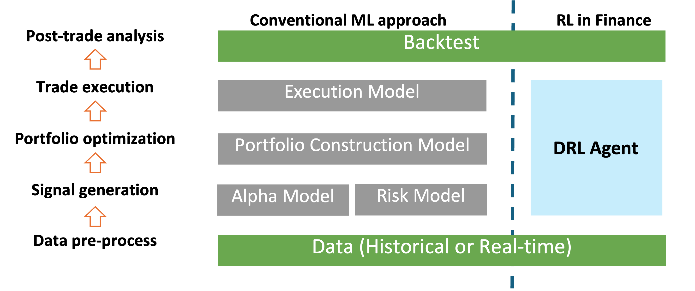

=============================
Overview
=============================

Financial reinforcement learning (FinRL) [1]_ [2]_ [3]_ is an interdisciplinary that applies reinforcement learning algorithms to financial tasks, such as order execution, portfolio management, high-frequency trading, option pricing and hedging, and market making [4]_ [5]_ [6]_. 

Motivation
-------------
Algorithmic trading is playing an important role in financial markets, accounting for over 60% of the total trading volume in the U.S. equity market. It relies on automated decision-making, which requires to make dynamic decisions, decide where to trade, what price, and what quality, and trade in a highly complex financial markets. The complex and dynamic nature of the financial markets make decision-making extremely challenging.

Deep Reinforcement Learning (DRL) is particularly well-suited for quantitative trading because it can
    - solve dynamic and sequential decision-making problems, which are very common in trading;
    - build a multi-factor model to trade automatically, including various market signals and risk factors;
    - offer portfolio scalability and market model independence, meaning it can adapt to different trading environments and market conditions.

Conventional ML approach usually involves multiple models, such as alpha models, risk models, and portfolio construction models, to perform trading tasks. In contrast, RL in finance introduces a single DRL agent that learns optimal trading decisions directly from data. It can simplifying the workflow while adapting to dynamic market conditions.

FinRL aims to automate the design pipeline of a DRL trading strategy, including four key steps:
    - preprocess market data
    - build a training env
    - manage trading states
    - backtest trading performance

Automated Trading in FinRL
------------------------------------------------
In an automated trading scenario in FinRL, there are two main components -- the agent and the environment:

    - **Agent** represents the investor or trader, who needs to take a trading action.
    - **Environment** represents the trading market. It contains market conditions, such as account balances, prices, balances, market indicators, and so on. The state is the snapshot of current market conditions.

.. image:: ../image/Auto_Trading_FinRL.png
   :width: 100%
   :align: center

For example, when facing the current state in the environment, the trader (agent) takes an action to buy 100 shares of AAPL. Then the environment will receive this action, step into a new state, and calculate the reward:

    - The cash used to buy the 100 shares will be subtracted from the balance.
    - The current holding shares of AAPL will increase by 100.
    - The prices and market indicators will be updated to the next trading interval.
    - The reward will reflect how much the trader earned from this trading action between the last state and the new state.

Facing the new state and reward, the trader will take a new action. This process continues, and the agent learns from its past trading experience to optimize the trading strategy.

**References**

.. [1] X.-Y. Liu, H. Yang, Q. Chen, R. Zhang, L. Yang, B. Xiao, and C. D. Wang. FinRL: A deep reinforcement learning library for automated stock trading in quantitative finance. *Deep Reinforcement Leanring Workshop, NeurIPS*, 2020.
.. [2] X.-Y. Liu, H. Yang, J. Gao, and C. D. Wang, “FinRL: deep reinforcement learning framework to automate trading in quantitative finance,” *ACM International Conference on AI in Finance*, 2022.
.. [3] X.-Y. Liu, Z. Xiong, S. Zhong, H. Yang, and A. Walid, “Practical deep reinforcement learning approach for stock trading,” *Workshop on Challenges and Opportunities for AI in Financial Services NeurIPS*, 2018.

.. [4] Ben Hambly, Renyuan Xu, and Huining Yang. Recent advances in reinforcement learning in finance. *Mathematical Finance*, vol. 33, no. 3, pp. 437–503, 2023.

.. [5] Shuo Sun, Rundong Wang, and Bo An. Reinforcement learning for quantitative trading. *ACM Transactions on Intelligent Systems and Technology*, vol. 14, no. 3, pp. 1–29, 2023.

.. [6] Yahui Bai, Yuhe Gao, Runzhe Wan, Sheng Zhang, and Rui Song. A review of reinforcement learning in financial applications. *Annual Review of Statistics and Its Application*, vol. 12, no. 1, pp. 209–232, 2025.