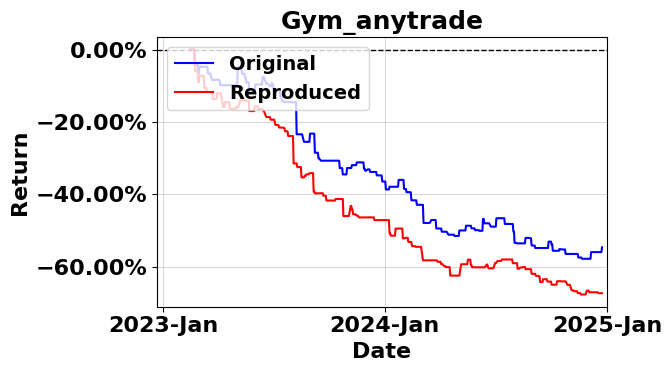

# Gym-anytrading
original code: https://github.com/AminHP/gym-anytrading/blob/master/gym_anytrading/envs/stocks_env.py


To evaluate the stock market environment from gym-anytrading, follow the following steps.
## Installation
```
git clone https://github.com/AminHP/gym-anytrading.git
cd gym-anytrading
```
Requirements are met if you ran the pipeline files in the same virtual environment.


## Run Original Code
We choose the SB3_a2c_quantstats.ipynb script at https://github.com/AminHP/gym-anytrading/blob/master/examples/SB3_a2c_quantstats.ipynb

1. Use the same YahooFinance Data

Run 1_Data.ipynb, and copy the three files generated to the same directory. To align the data, use the following command to convert our data to the expected format.
```
train = pd.read_csv('train_data.csv')
trade = pd.read_csv('trade_data.csv')
train_aapl = train[train["tic"] == "AAPL"]
train_gym_anytrade = pd.DataFrame()
train_gym_anytrade['Time'] = pd.to_datetime(train_aapl['date'])  # Convert to datetime
train_gym_anytrade['Open'] = train_aapl['open']
train_gym_anytrade['High'] = train_aapl['high']
train_gym_anytrade['Low'] = train_aapl['low']
train_gym_anytrade['Close'] = train_aapl['close']
train_gym_anytrade['Volume'] = train_aapl['volume']
train_gym_anytrade


trade_aapl = trade[trade["tic"] == "AAPL"]
trade_gym_anytrade = pd.DataFrame()
trade_gym_anytrade['Time'] = pd.to_datetime(trade_aapl['date'])  # Convert to datetime
trade_gym_anytrade['Open'] = trade_aapl['open']
trade_gym_anytrade['High'] = trade_aapl['high']
trade_gym_anytrade['Low'] = trade_aapl['low']
trade_gym_anytrade['Close'] = trade_aapl['close']
trade_gym_anytrade['Volume'] = trade_aapl['volume']
```
2. Modify training pipeline

The current file runs the training and trading stage with the same dataset, which makes results unsuitable for meaningful comparison with our pipeline. To address, create an environment for each stage, training and testing.

```
env_name = 'stocks-v0'

window_size = 30
start_index = window_size

env_train = gym.make(
    env_name,
    df=train_gym_anytrade,
    window_size=window_size,
    frame_bound=(window_size, len(train_gym_anytrade))
)

env_trade = gym.make(
    env_name,
    df=trade_gym_anytrade,
    window_size=window_size,
    frame_bound=(window_size, len(trade_gym_anytrade))
)
```
Modify environment used in each stage to use the correct datasets.

3.Save training data and prepare for plotting

```
def align_and_export_episode(env_trade, trade_df, time_col="Time", skip=30, out_path="Gym_anytrade.csv"):
    uw = env_trade.unwrapped

    start, end = uw._start_tick, uw._current_tick
    if end < start:
        raise ValueError(f"Invalid tick range: start={start}, end={end}")
    ep_len = end - start + 1

    index = uw.df.index[start:end+1] if hasattr(uw.df, "index") else np.arange(start, end + 1)

    pos_series = [
        None if p is None else getattr(p, "name", str(p))
        for p in uw._position_history[start:end+1]
    ]

    hist = uw.history or {}

    def get_hist(key):
        vals = list(hist.get(key, []))
        if len(vals) < ep_len:
            vals += [np.nan] * (ep_len - len(vals))
        return vals[:ep_len]

    df_ep = pd.DataFrame({
        "price":        uw.prices[start:end+1],
        "position":     pos_series,
        "total_reward": get_hist("total_reward"),
        "total_profit": get_hist("total_profit"),
        "daily_return": get_hist("daily_return"),
    }, index=index)

    if time_col not in trade_df.columns:
        raise KeyError(f"Column '{time_col}' not found in trade_df.")
    dates = pd.to_datetime(trade_df[time_col])

    date_idx = dates.iloc[skip: skip + len(df_ep)].reset_index(drop=True)
    df_ep_aligned = df_ep.reset_index(drop=True).copy()

    if len(date_idx) != len(df_ep_aligned):
        raise ValueError(
            f"Length mismatch: {len(date_idx)} dates vs {len(df_ep_aligned)} df_ep rows. "
            f"Adjust `skip` or verify episode length."
        )

    df_ep_aligned.index = date_idx
    df_ep_aligned.index.name = "Date"
    df_ep_aligned.to_csv(out_path)
    return df_ep_aligned


df_aligned = align_and_export_episode(env_trade, trade_gym_anytrade, time_col="Time", skip=30, out_path="Gym_anytrade.csv")
df_aligned
```
The complete modified file can be found [here](https://github.com/Allan-Feng/FinAI-Contest/blob/main/finai_contest/pipeline/original_scripts/gym_anytrading.ipynb).

## Reproduce in our pipeline
To reproduce the environment in our pipeline, follow the these steps to integrate the environment.
1. After reading YahooFinance data, align the format with
```
train_aapl = train[train["tic"] == "AAPL"]
train_gym_anytrade = pd.DataFrame()
train_gym_anytrade['Time'] = pd.to_datetime(train_aapl['date'])  # Convert to datetime
train_gym_anytrade['Open'] = train_aapl['open']
train_gym_anytrade['High'] = train_aapl['high']
train_gym_anytrade['Low'] = train_aapl['low']
train_gym_anytrade['Close'] = train_aapl['close']
train_gym_anytrade['Volume'] = train_aapl['volume']
train_aapl
```

2. Construct the environment
```
import gymnasium as gym
import gym_anytrading
env_train = gym.make(
    'stocks-v0',
    df=train_gym_anytrade,
    window_size=30,
    frame_bound=(30, len(train_gym_anytrade))
)
```
Create a method that wraps the environment to a stableBaselines3 DummyVecEnv.
```
from stable_baselines3.common.vec_env import DummyVecEnv

def get_sb_env(self):
    e = DummyVecEnv([lambda: self])
    obs = e.reset()
    return e, obs
# Patch the method
env_train = env_train.env
env_train = env_train.env
env_train.get_sb_env = get_sb_env.__get__(env_train)
```
3. For testing (3_Backtesting.ipynb), create two helper methods, save_action_memory and save_asset_memory, to save results from testing
```
def save_asset_memory(self):
    if "total_profit" not in self.history:
        print("Warning: 'total_profit' not found in history. Returning empty DataFrame.")
        return pd.DataFrame({"date": [], "account_value": []})
    dates = self.df['Time'][self._start_tick:self._current_tick].dt.strftime('%Y-%m-%d')
    profits = self.history["total_profit"]

    assert len(dates) == len(profits), f"Length mismatch: {len(dates)} dates vs {len(profits)} profits"

    df_account_value = pd.DataFrame({
        "date": dates,
        "account_value": profits
    })
    return df_account_value


def save_action_memory(self):
    if "total_profit" not in self.history:
        print("Warning: 'total_profit' not found in history. Returning empty DataFrame.")
        return pd.DataFrame({"date": [], "account_value": []})
    dates = self.df['Time'][self._start_tick:self._current_tick].dt.strftime('%Y-%m-%d')
    actions = self.history["position"]

    assert len(dates) == len(actions), f"Length mismatch: {len(dates)} dates vs {len(actions)} profits"

    df_account_value = pd.DataFrame({
        "date": dates,
        "action": actions
    })
    return df_account_value

e_trade_gym = e_trade_gym.env.env
e_trade_gym.save_asset_memory = save_asset_memory.__get__(e_trade_gym)
e_trade_gym.save_action_memory = save_action_memory.__get__(e_trade_gym)
```
4. Compare results
After running the original script and our pipeline, make sure result csv files are generated, and run plotstock_single.ipynb to plot and compare the two obtained results.



Notice both results have negative return because of transaction cost setting.

## Standardize the environment
We follow the standard used by env_stocktrading from FinRL-Meta, and refactored the code for gym_anytrading. It is provided at https://github.com/Open-Finance-Lab/FinAI-Contest/blob/main/finai_contest/env_stock_trading/env_stock_trading_gym_anytrading.py

Documentation is provided on the website.