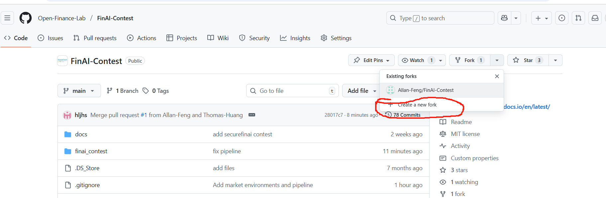
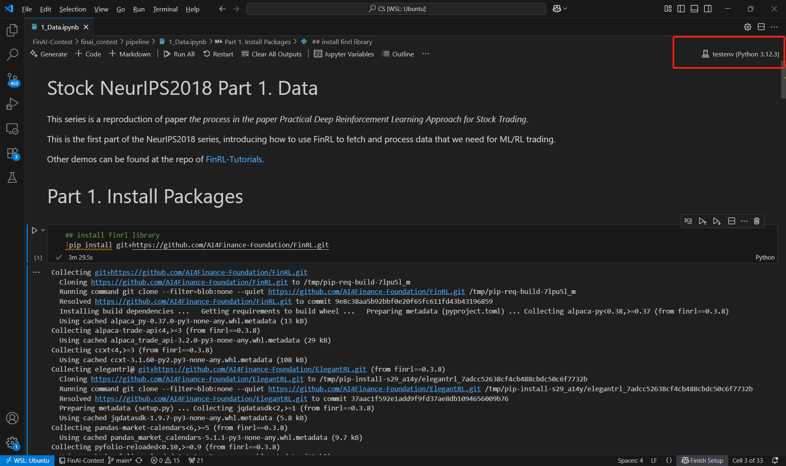

# Standard Market Environments for Reinforcement Learning
In this project, we organize current open-source market environments, and evaluated them in standard evaluation pipelines. Currently, we are evaluating stock and crypto market environments. Here is a tutorial to get you started and familiar with reproducing and evaluating market environments!

## Stock Market Evaluation Pipeline Setting
### Data

For stock market environments, we use yahooDownloader from FinRL to achieve daily data from YahooFinance. Information can be found in the link.
https://finrl.readthedocs.io/en/latest/finrl_meta/Data_layer.html

### Performance metrics

We use the following metrics to evaluate trading performance.
- Cumulative Reward: Percentage gain over the entire trading period
- Annualized Return: Average annual rate of return
- Annualized Volatility: How much return fluctuates annually
- Sharpe Ratio: Risk-adjusted return
- Maximum Drawdown: Maximum loss experienced during the trading period

Definition can be found in the FinRL documentation
https://finrl.readthedocs.io/en/latest/finrl_meta/Benchmark.html

### Baselines

The following baselines are used for comparisons
- Dow Jones Industrial Average (DJIA) index: Stock market index for 30 prominent US companies on stock exchange
- Mean-variance strategy: Balances low risk and high reward
- Equal-weight strategy: Equal weight assigned to each asset.

Definition can be found in the FinRL documentation
https://finrl.readthedocs.io/en/latest/finrl_meta/Benchmark.html

### Steps to organize and evaluate an environment
#### 1. Run Orginal Code
Run provided example tests in the project, plug in the same data from yahoofinance, and collect account values as results for comparison.

#### 2. Reproduce in our pipeline
Plug in the environment to our pipelines. Compare with results of the original code. This serves to ensure the consistency of our reproduction with the original code. Then, compare the trading performance with the baselines on unified performance metrics.
#### 3. Standardize the environment
Refactor the code for the environment to maintain the same state, action, reward design, following the standard format, including method design (name, arguments, returns) and parameter design and naming. The environment should follow the standard Gymnasium-Style. 

### Setting up the pipeline
1. Create your own fork of the Repository
https://github.com/Open-Finance-Lab/FinAI-Contest/tree/main


2. Clone your fork to local with the HTTPS link of your own fork

```
git clone https://github.com/<your-username>/FinAI-Contest.git
cd cd FinAI-Contest
```

3. Create virtual environment for jupyter notebook
```
sudo apt-get update && sudo apt-get install -y python3-venv

# 1) From your project root
python3 -m venv .venv

# 2) Activate the venv
source .venv/bin/activate

# 3) Upgrade packaging tools
python -m pip install --upgrade pip setuptools wheel

# 4) Install Jupyter + register this venv as a kernel
pip install jupyter ipykernel
python -m ipykernel install --user --name=proj-env --display-name "Python (proj-env)"
```

Select the Kernel you just created

4. Try running the first notebook 1_Data.ipynb\
https://github.com/Open-Finance-Lab/FinAI-Contest/tree/main/finai_contest/pipeline

## Stock Market Environments

### FinRL-Meta
original code: https://github.com/AI4Finance-Foundation/FinRL-Meta/blob/master/meta/env_stock_trading/env_stock_trading.py


### Gym-anytrading
original code: https://github.com/AminHP/gym-anytrading/blob/master/gym_anytrading/envs/stocks_env.py


